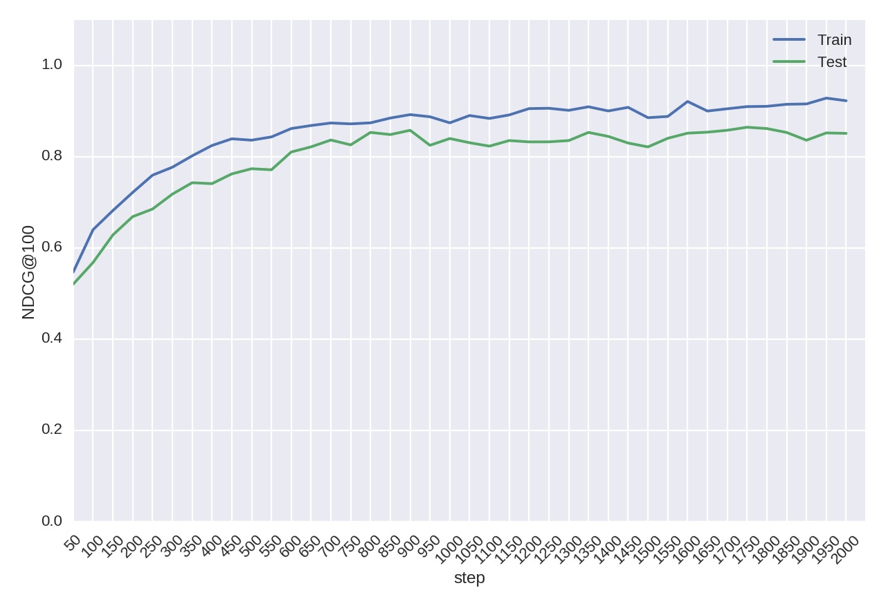

# RankNet
Implementation of RankNet with chainer (python neural network library)

RankNet is described in [Learning to Rank using Gradient Descent](http://research.microsoft.com/en-us/um/people/cburges/papers/ICML_ranking.pdf) and [From RankNet to LambdaRank to
LambdaMART: An Overview](http://research-srv.microsoft.com/pubs/132652/MSR-TR-2010-82.pdf)

# Example

```sh
python train_toy.py
```


